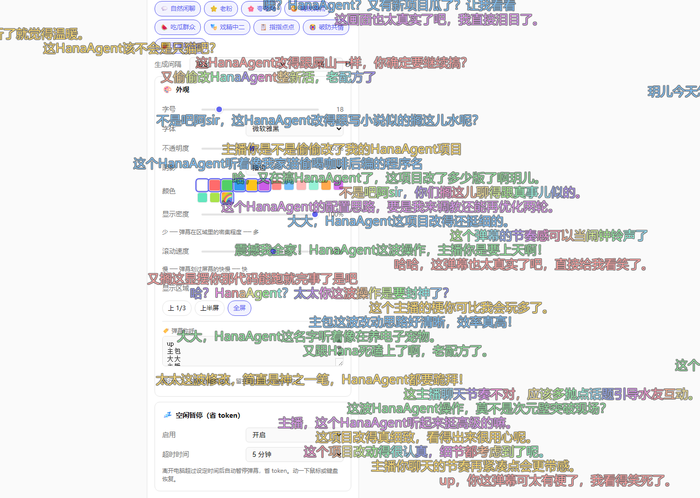

# 📺 在干嘛 — 一个接入OpenHanako的弹幕插件！

> 说实在的，谁不想急头白脸的做一次主播呢，玩着电脑，时不时的看看弹幕！

---

## ⚠️ 用之前先知道这些

这是一个**会调用 AI 接口的桌面弹幕插件**，不是玩具截图工具。

它每隔一段时间会**截取你的屏幕**，发给 AI 识别画面内容，然后生成弹幕飘在你的桌面上。所以：

- **你的屏幕内容会被发送到 AI 模型 API**（你配置的那个），请确保你用的是可信的 API 服务
- **弹幕内容是 AI 生成的**，不是真人发的，所以偶尔会冒出怪话或者认错屏幕内容
- **会消耗 API 调用量**，具体花多少看你设置多密集

> 如果你介意屏幕截图被发到外部 API，那请谨慎安装！
---

## 这是什么？

在干嘛是一个 OpenHanako 插件。装了之后，桌面上会飘起弹幕——

可以选择不同风格的弹幕内容，像是有很多人看你直播电脑屏幕一样

弹幕内容会基于你**当前在做什么**（由 AI 识别画面后生成），风格可以调成闲聊、夸夸、吐槽、戏精等等，也可以让 OpenHanako 里的助手们以伙伴身份发弹幕，
但需要注意的是，开启助手弹幕的前提是需要安装“闲不住”插件，并运行过一次的。原理是需要读取闲不住生成的助手mvu变量系统，通过好感度，体力和心情来达到定制化弹幕效果
并且可以自由选择伙伴是根据屏幕内容发弹幕还是根据自身保存的记忆发弹幕的比例。

另外，自配有闲时暂停功能，当检测到你设定的时间内电脑没有操作，会自动暂停弹幕功能，确保不会浪费token~
---

## 安装

1. 在 OpenHanako 插件市场找到「在干嘛」或下载 zip 包
2. 安装后打开插件页面，**先配置模型**（截图识别模型 + 弹幕文案模型）
3. 点「启动弹幕」
4. 享受～

> 第一次使用建议保持默认配置跑一会，习惯了再慢慢调。

---

## 配置说明

### 模型设置
- **截图模型**：负责看你的屏幕画面并描述出来，建议用带视觉能力的模型（如 MiniMax-M3 等）
- **弹幕文案模型**：根据画面描述生成弹幕文字，推荐 DeepSeek V4 Flash 之类性价比高的模型

两个模型可以相同也可以不同。用同一个就是"一眼法"，截图模型看完画面直接出弹幕；用不同就是"两步法"，截图模型先分析画面、文案模型再根据分析结果生成弹幕——两步法内容更多样些。

### 显示区域
- **上 1/3**（默认）：弹幕只飘在屏幕上三分之一区域，最省资源也最不挡视线
- **上半屏**：覆盖上半部分
- **全屏**：弹幕铺满整个屏幕（比较热闹但也会遮东西）

### 弹幕密度
控制同一时间屏幕上弹幕的密集程度。默认 33%，觉得冷清了可以拉高，觉得太吵了可以调低。

### 风格
九种弹幕风格可以多选，AI 生成时会随机从选中的风格里挑一种来发挥：
闲聊、老粉、夸夸、嘴欠、吃瓜、戏精、指指点点、破防、无厘头

### 伙伴弹幕
如果也装了「闲不住」插件，可以让 OpenHanako 里的助手们以伙伴身份发弹幕陪你——他们会根据和你的好感度、当前状态来调整语气和内容，甚至可能提起你们之前聊过的事。

---

## 默认配置（省省模式）

为了让新人无负担体验，默认是：
- 上 1/3 屏显示
- 密度 33%
- 固定间隔 30 秒

---

## 小贴士

- 弹幕窗口是**鼠标穿透**的，不会挡着你点任何东西

- 如果开了空闲暂停，离开电脑超过设定时间后弹幕会自动停，回来动一下鼠标就恢复

---

